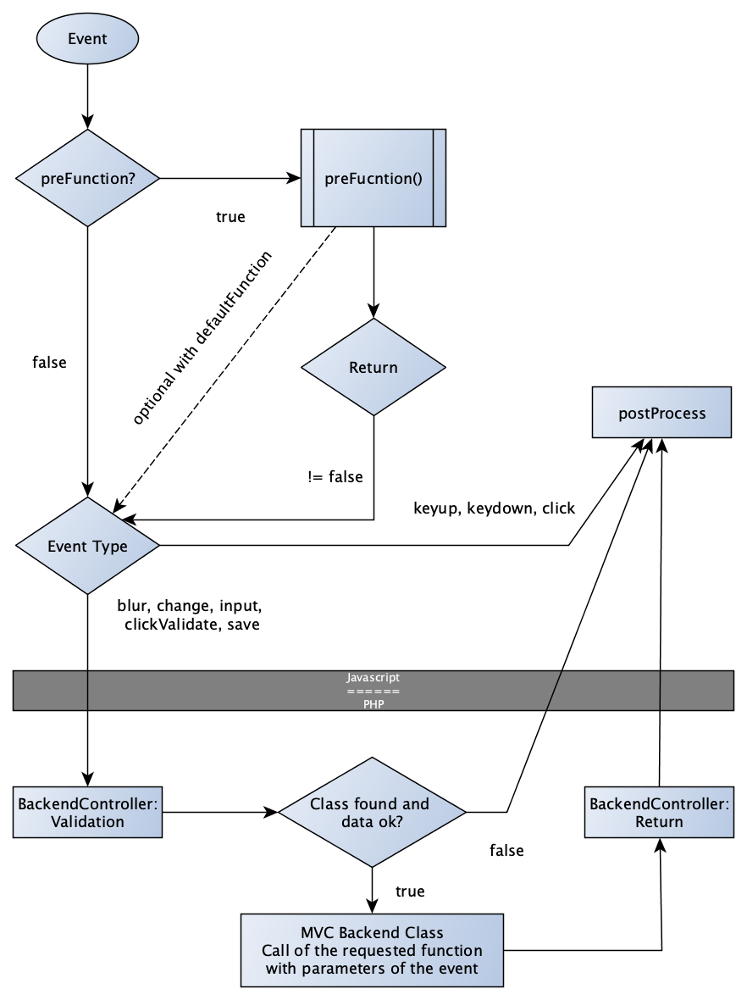

# SMD MVC2

The SMD MVC2 is an implementation for a frontend MVC on vanilla javascript. It uses [sApi()](https://github.com/codeandcreate/sApi) which is a fork if our internal javascript api.

It's build for [Newsfactory redFACT](https://www.newsfactory.de/solutions/cms-redfact.html) but can also used stand alone or with any other CMS. In this repository there are some sample scripts to use the MVC without redFACT. Some files may contain german comments. [Pure.css](https://purecss.io/) is usesd for the sample frontend.

## Version history

|&nbsp;&nbsp;&nbsp;&nbsp;&nbsp;&nbsp;&nbsp;&nbsp;&nbsp;Date&nbsp;&nbsp;&nbsp;&nbsp;&nbsp;&nbsp;&nbsp;&nbsp;&nbsp;&nbsp;|&nbsp;&nbsp;&nbsp;Version&nbsp;&nbsp;&nbsp;| Info |
|---|---|---|
| March 2022 | 2.1 | updated with internal version |
| Juli 2021 | 2.1 | updated mvc, pure.css and replaced smdQS with sApi |
| April 2019 | 2.0 | initial public version |

## Todos
- Documentation

## Installation

### redFACT
* Copy following files in your redFACT installation:
  - pu_all/ajax/mvcbackend.php
  - pu_all/scipts_min/00_mvc2baseInterface.js
  - pu_all/scipts_min/00_mvc2frontendcontroller.js
  - pu_all/scipts_min/00_sApi.min.js
  - (pu_base/scripts_min/00_mvc2platformSupport.js goes to your publication folder)
  - redFACT/customized/classes/mixed/mvcClasses/mvc_base.php
  - redFACT/customized/classes/mixed/szon_mixed_mvcbackendcontroller.php
  - redFACT/customized/classes/mixed/szon_mixed_mvcclassloader.php
  - redFACT/customized/classes/mixed/szon_mixed_registry.php
* pu_all/ajax/mvcbackend.php has a XSS protection: you need to add a $domains-Array to your inc/config.php (...) file with the domains that are allowed to access the mvc backend if not already set by your configuration
* Maybe you will need to replace "SZON" in the PHP Classes (redFACT/customized/classes/mixed/) with "NFYC" or any other in your installation configured prefix
* Take a look at the loader for contentbox, page,... in pu_all/templates/frontendbox.php
  
### without redFACT
  * just copy the whole folder to your webserver and take a look at the pu_base and inc folders.

## pu_base / How to use

In pu_base you will find a sample how to use the MVC. The code is written to work without redFACT, but the structure of a page or contentbox that uses the mvc is the same. A module that uses the MVC is always an extended default redFACT template.

- Template (PHP): /pu_.../templates/.../templatename.php
- Template (TAL): /pu_.../tpl/.../templatename.tal
- Class (PHP): /pu_.../classes/publication_module_templatename.php
- Class (Javascript): /pu_.../scripts/publication_module_templatename.js

In the example folder the javascript and php class is exactly how it would be used with redFACT.